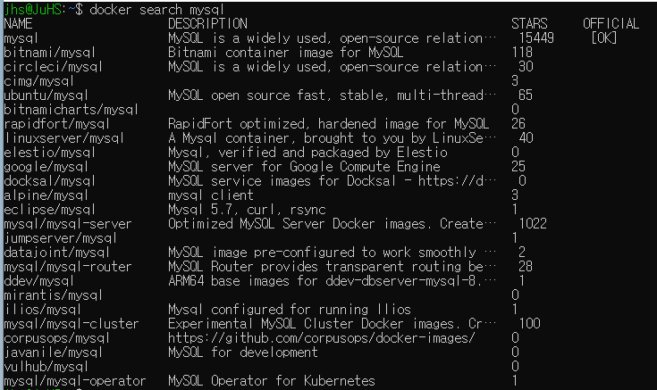
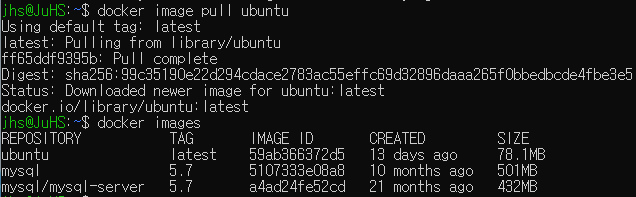

# 가상화란?
**컴퓨터 리소스의 추상화**<br>
즉 하나의 실물 컴퓨팅 자원을 마치 여러개인 것처럼 쪼개어 사용하거나 여러개의 실물 컴퓨팅 자원을 묶어서 하나의 자원인 것처럼 사용하는 것

물리적 리소스를 여러 사용자와 환경에 배포해 활용하는 기술

## 호스트 가상화
Host OS위에 Guest OS가 추가로 구동되는 방식<br>
가상화 소프트웨어 상에서 게스트 OS 구동<br>
ex) VMware, Virtual Box 등

**장점**
- Guest OS가 직접 하드웨어 리소스에 접근하는 것을 제어하고 동기화하기 때문에 Host OS에 크게 제약이 없음
  
**단점**
- OS위에 또 다른 OS를 얹히는 방식이기 때문에 오버헤드가 클 수 있음

## 하이퍼바이저 가상화
특정 OS에 의존하지 않고 하드에어에 직접 설치되는 구조<br>
별도의 Host OS가 필요없이 하이퍼바이저라는 펌웨어 단계에서 여러개의 OS 이미지들이 물리적 서버위에서 동작 할 수 있게 함<br>
ex) MS Hyper-V

**장점**
- 별도의 Host OS가 없어 오버헤드 낮음

**단점**
- 하드웨어를 제어할 OS가 없기 때문에 관리를 위한 컴퓨터나 콘솔이 필요함

### 전가상화


하드웨어를 완전히 가상화하는 방식<br>
CPU의 VT를 이용하는 관리용 가상머신 DOM0를 통해 게스트 OS들의 커널 요청을 번역하여 하드웨어에 전달

**장점**
- 게스트 OS의 수정 필요 없음

**단점**
- 모든 명령에 대해서 DOM0가 개입을 하여 중재하는 형태이기 때문에 병목 현상으로 인한 성능 저하 발생

### 반가상화


하드웨어를 부분적으로 가상화 하는 방식

**장점**
- 하이퍼 콜이라는 인터페이스를 통해 하이퍼바이저에게 직접 요청을하고 하이퍼바이저가 제어르 ㄹ직접 하기 때문에 높은 퍼포먼스 유지 가능

**단점**
- 하이퍼 콜 요청을 할 수 있도록 게스트 OS의 수정된 커널이 요구 됨

## 컨테이너 가상화
Host OS 상에 논리적인 구역을 만들고 애플리케이션을 동작시키는데 필요한 라이브러리와 애플리케이션 등을 
컨테이너 안에 포함시켜 게스트 OS없이도 개별 서버와 같이 실행환경을 구축하는 방식

각각의 애플리케이션은 데이터를 저장하는 디렉토리, IP 주소를 공유

**장점**
Guest OS의 실행에 소요되는 오버헤드가 없기 때문에 고속으로 작동

[참고](https://www.openmaru.io/%EC%BB%A8%ED%85%8C%EC%9D%B4%EB%84%88-%EA%B0%80%EC%83%81%ED%99%94/)

# Docker란
컨테이너 기반으로 하는 오픈소스 가상화 플랫폼<br>
개발자가 컨테이너를 빌드, 배포, 실행, 업데이트 및 관리를 할 수 있는 오픈소스 플랫폼

## Docker 사용목적
1. 빠르고 일관된 애플리케이션 제공
2. 효율적인 배포
   - APP과 종속성을 컨테이너라는 단위로 패키징하여 일관적으로 배포할 수 있음
   - 배포 프로세스 자동화 가능
3. 확장성
4. 격리된 환경


## Docker 용어
- 도커 클라이언트: 도커 데몬에게 도커 API로 빌드, 실행, 설치를 요청하는 프로세서
- 도커 호스트: 도커 데몬을 실행하고 실제 image를 저장하고 container를 돌리는 머신
- 도커 데몬: 도커 클라이언트로부터 받은 요청을 처리하여 이미지, 네트워크, 볼륨, 컨테이너에 해당하는 도커 객체를 관리하는 프로세스
- 도커 레지스트리: 도커 이미지를 저장하는 저장소(도커 허브), 깃허브 같은 것
- 도커 객체: 도커에서 생성하고 사용하는 객체
  - 이미지: 컨테이너를 생성하기 위한 읽기 전용 텀플릿 명령어 (클래스?)
  - 컨테이너: 이미지가 실행가능한 상태에 해당하는 인스턴스 (객체?)
- 도커 엔진: 도커 플랫폼의 핵심 구성요소, 주로 도커데몬, cli(클라이언트), containerd등의 구성요소로 이루어져있음
  - Docker가 전체적인 플랫폼을 의미하면 도커엔진이 플랫폼의 핵심 부분을 의미

## 기본적인 도커 명령어
- 명령어 구조 : docker [대상] [액션]
  - 대상: container(생략가능), image, volume, network등
  - 액션: ls, run, start 등

### 도커 이미지
[도커 허브](https://hub.docker.com/)에서 이미지를 확인할 수 있음<br>
혹은 cli search 명령어로 간단하게 확인할 수 있다

```bash
docker search mysql
```


```
**간단한 흐름**<br>
Registry <--> Images <--> Container


이러한 이미지들은 도커 레지스트리에 저장이 되는데 public, private 두가지로 나뉘게 됨<br>
public 에는 대표적으로 도커허브, AWS Container Registry 등이 있음<br>
사용자가 직접 레지스트리를 구축해서 자신의 내부망에서 사용하거나 외부망과 연결해서 사용 가능<br>
이미지는 그 자체로 사용할 수 없고 컨테이너에 추가해야지 사용 가능

이미지에 태그를 작성하는데 이는 이미지 버전을 기록, 만일 태그가 없다면 도커엔진은 latest로 인식
```


- **이미지 다운로드**
  -  docker image pull
- **다운로드한 이미지 확인**
  - docker images, docker image ls
- **docker file로부터 이미지 생성**
  - docker build -t [사용자명/이미지명:tag] . 
  - 단! 도커 파일 있는 위치에서 하기 경로지정 귀찮..
- **컨테이너로 이미지 생성**
  - docker container commit -m "commit message" -a "user" [container_name] [사용자명/이미지명:tag]
- **이미지 registry 업로드**
  - docker push [사용자명/이미지명:tag]
  - docker login 선행, 이미지 이름을 사용자명:이미지명으로 변경 해야함
- **이미지 태그 설정**
  - docker tag [이미지명] [바꿀이름]
- **이미지 삭제**
  - docker image rm [이미지명]



### 도커 컨테이너
- docker (container) create: 생성하고 자동으로 시작하지는 않음

## 도커 파일


# 더 찾아볼 내용
- Docker가 어떻게 격리된 환경을 제공하는지
  - cgroup, namespace
- Docker 원격 접근
- Linux도 공부하면 좋을 듯
- 네트워크
- 도커 레지스트리 private 구축