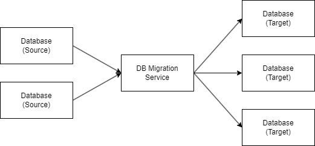

## Flyway란
> 데이터베이스 마이그레이션 오픈소스 툴

데이터베이스의 변경 사항 추적, 업데이트 롤백 도와주는 도구

DB관리계의 Git??!!?

### DB 마이그레이션??
하나 이상의 Source DB에서 하나 이상의 Target DB로 데이터를 이주(이관) 하는 프로세스 **With DB 마이그레이션 서비스(Flyway)**

#### DB 복제와 비교
**Migration**

목적: 데이터베이스 구조 변경 or 이동

주요 기능: 스키마 변경, 데이터 이전

**Replication**

목적: 데이터베이스 실시간 복제, 가용성 향상

주요 기능: 데이터 복제, 가용성 향상, 읽기 부하분산