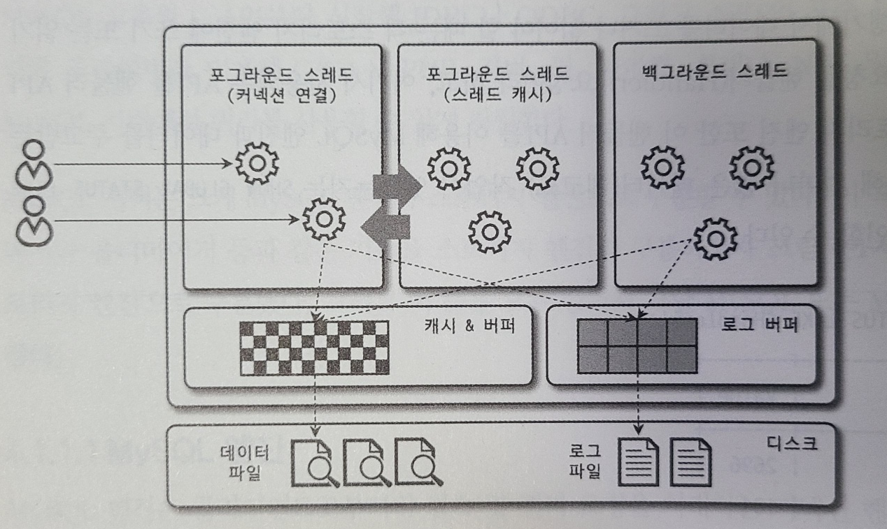

# 서버 아키텍처 구조
MySQL 서버 = MySQL 엔진 + 스토리지 엔진

## 메모리 구조
### 글로벌 영역
하나의 메모리 공간만 할당, 모든 스레드에 의해 공유

- 테이블 캐시
- InnoDB 버퍼 풀
- InnoDB 어댑티브 해시인덱스
- InnoDB 리두 로그 버퍼

### 로컬 영역(세션 영역)
클라이언트 스레드가 쿼리를 처리하는데 사용하는 메모리 영역, 스레드 당 하나씩 할당

- 조인 버퍼
- 정렬 버퍼
- 바이너리 로그 캐시
- 네트워크 버퍼

---
---

## MySQL 엔진
**서버 하나에 한개만 존재**
- 커낵션 핸들러
- SQL Parser & 전처리기
- 옵티마이저
- 쿼리 실행기

### 스레드 기반으로 작동
목록은 performance_schema.thread 테이블에서 확인 가능<br>
동일한 이름 2개 이상인 경우에는 서버 설정에 의해 여러 스레드가 동일 작업을 병렬로 처리


- 포그라운드 스레드

클라이언트 스레드라고도 함 (MySQL 서버에 접속된 클라이언트 수만큼 존재 - 쿼리 문장 처리 목적)<br>
작업 종료 시 스레드 캐시로 반환(단! 스레드 캐시 최대 개수(thread_cache_size)까지 이후는 반환 대신 종료)

데이터를 버퍼/캐시 or 디스크로부터 읽어옴<br>
MyISAM에서는 쓰기 작업까지 같이 진행, InnoDB에서 쓰기작업은 백그라운드 스레드가 진행

- 백그라운드 스레드

**MyISAM 해당사항 없음**

로그를 디스크로 기록<br>
InnoDB 버퍼 풀의 데이터 디스크에 기록

인서트 버퍼 병합<br>
데이터 버퍼로부터 읽어오기<br>
잠금이나 데드락 모니터링

### 쿼리 실행 구조
1. 쿼리 파서
   1. 쿼리 문장을 토큰으로 분리해 트리 형태 구조로 만듬
   2. 문법 오류 체크 단계
2. 전처리기
   1. 테이블, 칼럼명 등 객체의 존재 여부 및 접근 권한 체크
3. 옵티마이저
   1. 가장 빠르게 가장 저렴한 비용으로 처리하는 방법 결정
4. 실행 엔진
   1. 계획대로 각 핸들러에게 요청해서 받은 결과를 다른 핸들러(스토리지 엔진) 요청의 입력으로 연결

### 스레드 풀
MySQL CE에서는 제공X, MySQL EE에서 제공

동시 처리되는 요청이 많더라도 MySQL 서버의 CPU가 제항된 개수의 스레드 처리에만 집중할 수 있게 도움<br>
-> 불필요한 컨텍스트 스위치 줄여주기 때문

기타 설정을 위해서는 thread_pool_stall_limit, thread_pool_max_threads 찾아보기!

## 핸들러 API
쿼리 실행기에서 데이터를 쓰거나 읽어야 할 때 요청: 핸들러 요청<br>
핸들러 요청에서 사용되는 API: 핸들러 API

---
---

## 스토리지 엔진
**서버 하나에 여러 개를 동시에 사용 가능**
```sql
create table test (id INT, name varchar) ENGINE=INNODB;
create table test (id INT, name varchar) ENGINE=MYISAM;
```

실제 데이터를 디스크 스토리지에 저장하거나 읽어오는 역할
### InnoDB

### MyISAM