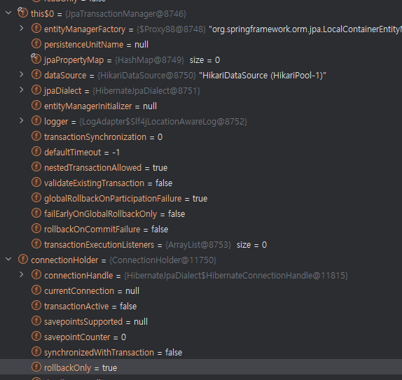

```java
@Service
@RequiredArgsConstructor
public class ChildService {

    private final ChildRepository childRepository;

    public Child innerMethod(int id) {
        return childRepository.findById(id)
                .orElseThrow(() -> new IllegalArgumentException("Child not found"));
    }

}
```

```java
@Slf4j
@Service
@RequiredArgsConstructor
public class ParentService {

    private final ChildService childService;

    public List<Child> getChildren() {
        List<Child> result = new ArrayList<>();
        for (int i = 0; i < 10; i++) {
            try {
                result.add(childService.innerMethod(i));
            } catch (IllegalArgumentException e) {
                log.warn("parent service catch exception and solve");
            }
        }

        return result;
    }

}
```

## 예상 동작
트랜잭션 전파 속성이 기본 `REQUIRED`로 되어있고 내부 트랜잭션은 새로운 물리 트랜잭션 사용 없이 외부 트랜잭션을 이어나가는 것 -> 트랜잭션 커밋 전에 예외를 처리했으니 문제가 없어야 한다

## 실제 동작
예외 처리 상관 없이 트랜잭션 전체 롤백
```
org.springframework.transaction.UnexpectedRollbackException: Transaction silently rolled back because it has been marked as rollback-only
	at org.springframework.transaction.support.AbstractPlatformTransactionManager.processCommit(AbstractPlatformTransactionManager.java:804) ~[spring-tx-6.1.13.jar:6.1.13]
	at org.springframework.transaction.support.AbstractPlatformTransactionManager.commit(AbstractPlatformTransactionManager.java:758) ~[spring-tx-6.1.13.jar:6.1.13]
	at org.springframework.transaction.interceptor.TransactionAspectSupport.commitTransactionAfterReturning(TransactionAspectSupport.java:663) ~[spring-tx-6.1.13.jar:6.1.13]
	at org.springframework.transaction.interceptor.TransactionAspectSupport.invokeWithinTransaction(TransactionAspectSupport.java:413) ~[spring-tx-6.1.13.jar:6.1.13]
	at org.springframework.transaction.interceptor.TransactionInterceptor.invoke(TransactionInterceptor.java:119) ~[spring-tx-6.1.13.jar:6.1.13]
	at org.springframework.aop.framework.ReflectiveMethodInvocation.proceed(ReflectiveMethodInvocation.java:184) ~[spring-aop-6.1.13.jar:6.1.13]
	at org.springframework.aop.framework.CglibAopProxy$CglibMethodInvocation.proceed(CglibAopProxy.java:768) ~[spring-aop-6.1.13.jar:6.1.13]
	at org.springframework.aop.framework.CglibAopProxy$DynamicAdvisedInterceptor.intercept(CglibAopProxy.java:720) ~[spring-aop-6.1.13.jar:6.1.13]
```

rollback 로직을 따라가보면 `AbstractPlatformTransactionManager` 내부에서 globalRollback을 확인하고 최초 트랜잭션 커밋 시점에 롤백 진행




```
Set whether to globally mark an existing transaction as rollback-only after a participating transaction failed.
Default is "true": If a participating transaction (e. g. with PROPAGATION_REQUIRED or PROPAGATION_SUPPORTS encountering an existing transaction) fails, the transaction will be globally marked as rollback-only. The only possible outcome of such a transaction is a rollback: The transaction originator cannot make the transaction commit anymore.
-> 참여중인 트랜잭션 롤백하면 최초 트랜잭션 매니저도 해당 트랜잭션 커밋 못함 롤백해야함

The recommended solution for handling failure of a subtransaction is a "nested transaction", where the global transaction can be rolled back to a savepoint taken at the beginning of the subtransaction. 

PROPAGATION_NESTED provides exactly those semantics; however, it will only work when nested transaction support is available. This is the case with DataSourceTransactionManager, but not with JtaTransactionManager.

<추가>
PROPAGATION_NESTED uses a single physical transaction with multiple savepoints that it can roll back to. Such partial rollbacks let an inner transaction scope trigger a rollback for its scope, with the outer transaction being able to continue the physical transaction despite some operations having been rolled back. This setting is typically mapped onto JDBC savepoints, so it works only with JDBC resource transactions. 
```

## 이후 실험들
Transaction 전파 속성 변경

 -> NESTED 가 내부 트랜잭션 결과가 외부에 영향을 안주는 걸로 알고 있어서 해봤지만 실패 예외 발생으로 프로그램 종료

checkedException으로 변경 후 처리
 
 -> 처리는 가능하나 메소드에 `throws`명시해야 해서 지저분해짐..

내부 트랜잭션 제거

  -> 트랜잭션 관리가 활성화 되지 않기때문에 문제 자체는 해결 되지만 타 서비스에서 호출할 경우 트랜잭션 관리의 어려움이 있을 수 있음 좋은 방법은 아닌 듯


## 정리
UncheckedException의 경우 CheckedException 과는 다르게 인지하지 못한 결과에 의해 발생 할 수 있기 때문에 스프링에서 롤백 대상으로 삼은 것 같음

exception을 처리해서 비지니스 로직 상에서 정상적으로 돌아가게 만들고 싶으면 CheckedException을 하는게 좋지 않을까??
